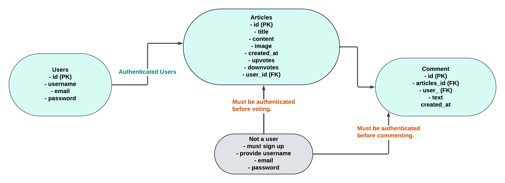

# Autosphere

Auto-Sphere is a modern, interactive platform designed to showcase articles about cars, provide user interactivity through upvotes, downvotes, and comments, and offer an engaging experience for both users and administrators.

# Table Of Contents

- [Product Objective](#product-objective)
- [Site Users Goals](#site-users-goals)
- [Site Owner's Goals](#site-owners-goals)
- [GitHub Project Board](#github-project-board)
- [User Experience](#user-experience)
- [Wireframes](#wireframes)
- [User Stories](#user-stories)
- [Color Used](#color-used)
- [Existing Features](#existing-features)
- [Features Left to Implement](#features-left-to-implement)
- [Technologies Used](#technologies-used)
- [Testing](#testing)

## Project Objective
The **AutoSphere** project is designed to provide users with both old and  latest automobile articles, featuring engaging content and a seamless user experience.

## Site Users' Goals

The AutoSphere platform is designed to meet the following goals for its users:

- **Read Automobile Articles**
Users can browse through a collection of well-written and informative articles about various topics related to cars, including:
The latest car models and their features.
Industry trends and news about the automobile world.
Maintenance tips and buying guides for car enthusiasts.
Articles are displayed in an easy-to-read format with images to enhance the reading experience.

- **Comment and Engage in Discussions**
Users can actively participate in discussions by adding comments to articles.
The commenting feature allows users to:
Share their opinions or feedback on specific articles.
Interact with other users' comments to encourage community discussions.
The speech bubble icon shows the number of comments, making it easy for users to find highly-discussed articles.

- **Vote on Articles and Comments** 
Users can express their agreement or disagreement with the content by:
**Upvoting**: Showing appreciation for articles or comments they find helpful or interesting.
**Downvoting**: Indicating disagreement or dissatisfaction with the content.
Voting helps highlight the most popular articles and comments, improving content discovery and engagement.

By offering these features, AutoSphere ensures an interactive and engaging experience for all users, fostering a vibrant community of car enthusiasts.

## Site Owner's Goals

The AutoSphere site owner aims to achieve the following objectives:

- **Attract More Users**:  
  By consistently publishing high-quality and engaging content about automobiles, the platform seeks to draw in car enthusiasts, industry professionals, and casual readers interested in cars.

- **Provide an Intuitive and Interactive Platform**:  
  AutoSphere is designed to offer a seamless and user-friendly experience, enabling users to explore content, participate in discussions, and easily navigate the site. Features such as responsive design and clear navigation bars contribute to this goal.

- **Facilitate User Engagement**:  
  Encouraging interaction is key to building a vibrant community. Through voting systems for articles and comments, as well as providing an easy way for users to comment on articles, the site fosters active discussions and a sense of participation.

These goals work collectively to establish AutoSphere as a go-to platform for automotive news, insights, and community engagement.

## GitHub Project Board

The **GitHub Project Board** is an essential tool i used for organizing and managing the development workflow of the AutoSphere project. It helped me in such a way that i have to track progress, and ensure all project objectives are met efficiently.

### Structure of the Project Board
The project board is divided into the following columns to represent the workflow:

1. **To Do**:  
   This column contains all tasks and features that need to be implemented. It includes user stories, bug fixes, and enhancements that are planned but not yet started.

2. **In Progress**:  
   Tasks that are actively being worked on are moved to this column. This provides a clear view of what is currently being developed.

3. **Done**:  
   Once a task is reviewed, tested, and deployed, it is moved to this column to indicate completion.

### Key Features of the GitHub Project Board

- **Task Categorization**:  
  Each task is represented as a card, which includes a title, description, labels, and assignees. Labels such as `bug`, `feature`, `enhancement`, and `documentation` help categorize the cards for clarity.

- **Milestones**:  
  Milestones are used to group related tasks and track progress toward significant project goals. Each milestone represents a feature release or a development phase.

   ## Database Schema

The **Auto-Sphere** project uses a relational database schema designed to store and manage data efficiently for articles, comments, and user interactions. Below is the detailed table structure of the autosphere database schema:

### 1. `Article` Table
Stores all articles published on the platform.

| **Field Name**  | **Data Type**          | **Description**                            |
|------------------|------------------------|--------------------------------------------|
| `id`            | AutoField (Primary Key) | Unique identifier for each article.        |
| `title`         | CharField (max_length=200) | Title of the article.                     |
| `content`       | TextField              | Detailed content of the article.           |
| `image`         | ImageField             | Associated image for the article.          |
| `created_at`    | DateTimeField          | Timestamp when the article was created.    |
| `upvotes`       | PositiveIntegerField   | Number of upvotes the article has received. |
| `downvotes`     | PositiveIntegerField   | Number of downvotes the article has received. |

### 2. `Comment` Table
Stores all comments associated with articles.

| **Field Name**  | **Data Type**          | **Description**                            |
|------------------|------------------------|--------------------------------------------|
| `id`            | AutoField (Primary Key) | Unique identifier for each comment.        |
| `article`       | ForeignKey (to `Article`) | Links the comment to a specific article.   |
| `name`          | CharField (max_length=100) | Name of the user who commented.            |
| `text`          | TextField              | Content of the comment.                    |
| `created_at`    | DateTimeField          | Timestamp when the comment was created.    |

### 3. `User` Table *
Manages user authentication and permissions.

| **Field Name**  | **Data Type**          | **Description**                            |
|------------------|------------------------|--------------------------------------------|
| `id`            | AutoField (Primary Key) | Unique identifier for each user.           |
| `username`      | CharField (max_length=150) | Username chosen by the user.               |
| `email`         | EmailField             | User's email address.                      |
| `password`      | CharField              | Encrypted password for authentication.     |

## Lucid Chart Diagram of Database Schema

# Wireframes

## User Stories

 * Below are 3 different types of users that will likely visit my site.

   *  Normal User (Not Logged In)
   *  Logged-In User
   *  Superuser (Admin)   

 ## Normal User (Not Logged In)

 * As new a user i want Access a signup page and interact with the platform.
 * As a new user, i want to access a Log in page to my account if I already have one.
 * As a site user, I want to view a visually appealing homepage so that I have a welcoming and engaging first impression of the site. 

 ## Logged-In User 
1. As a logged in user, I want to comment on articles so that I can share my opinions and join discussions.  
2. As a logged in user, I want to upvote or downvote articles so that I can engage with the content and show my approval or disapproval.  
3. As a logged in user, I want to upvote or downvote comments so that I can participate in discussions by supporting or disagreeing with comments.  
4. As a logged in user, I want to see the number of comments on each article so that I can gauge the engagement level on a particular topic. 
5. As a logged in user, I want to edit or delete my own comments so that I can update my input or remove irrelevant comments I’ve posted.  
6. As a logged in user, I want to save articles to my favorites or bookmarks so that I can access articles I like easily in the future.  
7. As a logged in user, I want to access a logout option so that I can securely exit the platform after using it.  
8. As a logged in user, I want to access the full details of an article by clicking it so that I can read the complete article and understand the topic in detail.  
9. As a logged in user, I want to see a clear and user-friendly navigation bar so that I can easily navigate to different parts of the website.  
10. As a logged in user, I want to access a responsive layout across all devices so that I can browse the site seamlessly on mobile, tablet, or desktop. 

## Superuser (Admin)
1. As an admin, I want to add new articles to the site so that I can keep the content fresh and up-to-date for users.  
2. As an admin, I want to edit existing articles so that I can correct errors or update outdated information.  
3. As an admin, I want to delete inappropriate or irrelevant articles so that I can maintain the quality and relevance of the site content.  
4. As an admin, I want to approve or moderate user comments so that I can ensure discussions remain respectful and adhere to guidelines.  
5. As an admin, I want to delete inappropriate user comments so that I can keep the platform safe and welcoming for all users.  
6. As an admin, I want to view and manage user accounts so that I can monitor user activity and take necessary administrative actions.  
7. As an admin, I want to ban or suspend users violating the rules so that I can protect the platform from misuse or harmful behavior.  
8. As an admin, I want to access the panel any time.
9. As an admin, I want to manage site settings, such as the navigation layout, so that I can update features to improve user experience.  
10. As an admin, I want to view reports or flagged content from users so that I can address problematic content or behavior quickly and efficiently.  

## Color Used

## Existing Features

 * Home page
   * Displays a welcome message introducing the site and its purpose as well as providing easy to login and and sign up links.
 

 * Navigation Bar
   * A fixed navbar with links to Home, Sign Up, Login, and Articles pages.The navigation bars are Fully responsive and collapsible on smaller screens.

 * Sign Up Page
    * Allows users to create an account with secure validation.

 * Sign Out Page

 * Log In Page
     * Enables existing users to log in securely with a "Remember Me" checkbox for conveniences. If users wants to explore the site, there are been reminded to signup if they do not have an account.

  * Log Out Page
     * This page displays a modal asking, "Are you sure you want to log out?" This helps to confirms the users final decision before logging out.

  * Articles Page
     * This page displays articles in a card layout with title, image, and truncated content preview. Upvote and downvote buttons are available with comment count displayed via a speech bubble icon.

  * Footer
      * Contains links to Facebook, Instagram, and Twitter. Includes copyright information.

  * Admin Dashboard
      * This page allows the site owner manage articles, comments, etc.

 # Features Left to Implement
* Comment Notifications: Notify users of new comments or replies.
* User Profiles: Add detailed profiles for users.
* Enhanced Commenting: Allow users to reply to comments.
* Improved Comment Deletion: Allow users to delete their comments with confirmation.

 ## Technologies Used

### **Front-End**
- **HTML5**: This was used to provide the structure and semantics of the web pages.

- **CSS3**: It is used to  Styles the website with responsive and visually appealing designs.

- **JavaScript (ES6)**: Adds interactivity and dynamic functionality to the user interface.
- **Python (Django)**: Manages the server-side logic, routing, and database interactions using the Django web framework.

### **Authentication and Security**
- **Django AllAuth**: Provides user authentication, registration, and account management features.

- **Git**: Tracks changes to the codebase, enabling collaboration and versioning.

- **GitHub**: Hosts the project repository, facilitating version control and deployment.

- **Heroku**: Used for hosting the live website, with easy integration for deploying Django applications.

- **Lucidchart**: Used to create database schemas and wireframes during the planning phase.

- **W3C HTML Validator**: Validates the structure and syntax of the HTML files.

- **W3C CSS Validator**: Ensures the CSS adheres to standards and is error-free.

- **Django Test Framework**: Verifies the functionality of views, models, and forms in the application.

- **Google Fonts**: Provides custom typography to enhance the visual appeal.
- **FontAwesome**: Supplies scalable icons for social links and UI elements.

 ## External Libraries

 * asgiref==3.8.1
 * cloudinary==1.42.1
 * dj-database-url==2.3.0
 * Django==5.1.4
 * django-cloudinary-storage==0.3.0
 * pillow==11.0.0
 * pytz==2024.2
 * sqlparse==0.5.3
 * whitenoise==6.8.2

# Testing

Please [click here](testing.md) to read more about testing of the AutoSphere app.

     

              
    