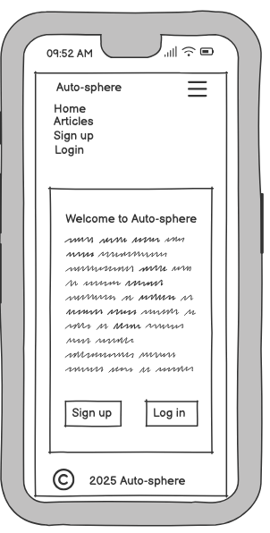
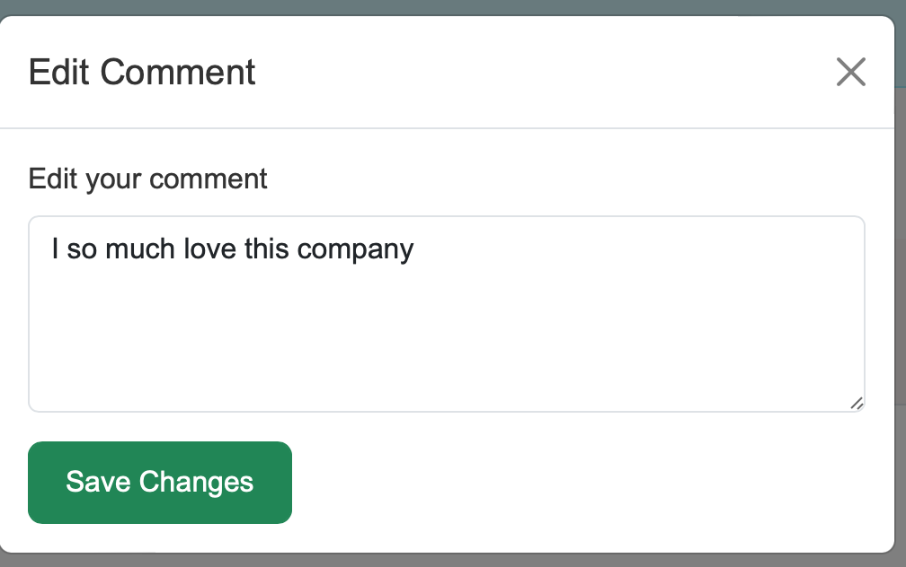

# Autosphere

Auto-Sphere is a modern, interactive platform designed to showcase articles about cars, provide user interactivity through upvotes, downvotes, and comments, and offer an engaging experience for both users and administrators.

https://auto-sphere-0cb7f208e934.herokuapp.com

# Table Of Contents

- [Project Objective](#project-objective)
- [Site Users Goals](#site-users-goals)
- [Site Owner's Goals](#site-owners-goals)
- [Agile Methodology](#agile-methodology)
- [GitHub Project Board](#github-project-board)
- [Wireframes](#wireframes)
- [User Stories](#user-stories)
- [Color Scheme](#color-scheme)
- [Typography](#typography)
- [Existing Features](#existing-features)
- [Features Left to Implement](#features-left-to-implement)
- [Technologies Used](#technologies-used)
- [External Libraries](#external-libraries)
- [Database Design](#database-design)
- [Testing](#testing)
- [Deployment](#deployment)
- [Credits](#credits)
- [Acknowledgements](#acknowledgements)

## Project Objective

The **AutoSphere** project is designed to provide users with both old and  latest automobile articles, featuring engaging content and a seamless user experience.

## Site Users' Goals

The AutoSphere platform is designed to meet the following goals for its users:

- **Read Automobile Articles**
Users can browse through a collection of well-written and informative articles about various topics related to cars, including:
The latest car models and their features.
Industry trends and news about the automobile world.
Maintenance tips and buying guides for car enthusiasts.
Articles are displayed in an easy-to-read format with images to enhance the reading experience.

- **Comment and Engage in Discussions**
Users can actively participate in discussions by adding comments to articles.
The commenting feature allows users to:
Share their opinions or feedback on specific articles.
Interact with other users' comments to encourage community discussions.
The speech bubble icon shows the number of comments, making it easy for users to find highly-discussed articles.

- **Vote on Articles and Comments** 
Users can express their agreement or disagreement with the content by:
**Upvoting**: Showing appreciation for articles or comments they find helpful or interesting.
**Downvoting**: Indicating disagreement or dissatisfaction with the content.
Voting helps highlight the most popular articles and comments, improving content discovery and engagement.

By offering these features, AutoSphere ensures an interactive and engaging experience for all users, fostering a vibrant community of car enthusiasts.

## Site Owner's Goals

The AutoSphere site owner aims to achieve the following objectives:

- **Attract More Users**:  
  By consistently publishing high-quality and engaging content about automobiles, the platform seeks to draw in car enthusiasts, industry professionals, and casual readers interested in cars.

- **Provide an Intuitive and Interactive Platform**:  
  AutoSphere is designed to offer a seamless and user-friendly experience, enabling users to explore content, participate in discussions, and easily navigate the site. Features such as responsive design and clear navigation bars contribute to this goal.

- **Facilitate User Engagement**:  
  Encouraging interaction is key to building a vibrant community. Through voting systems for articles and comments, as well as providing an easy way for users to comment on articles, the site fosters active discussions and a sense of participation.

These goals work collectively to establish AutoSphere as a go-to platform for automotive news, insights, and community engagement.

[Back to Top](#)

## Agile Methodology

### Agile Methodology Implementation

For this project, I implemented Agile methodology using GitHub Projects to manage tasks, track progress, and ensure an iterative development process. Below is an overview of how Agile principles were applied:

### GitHub Project Board

I created a GitHub Project to organize tasks and streamline the development workflow. The project board follows a Kanban structure with the following columns:

[GitHub Projects](https://github.com/ozi-cheri/auto-sphere)

* To Do – Upcoming tasks and features to be implemented. It includes user stories, bug fixes, and enhancements that are planned but not yet started.

* In Progress – Tasks currently being worked on. This provides a clear view of what is currently being developed.

* Done – Completed tasks. Once a task is reviewed, tested, and deployed, it is moved to this column to indicate completion.

 

### New Issues and Title

Instead of traditional Milestones, I structured work using New issues, title and description. After creating new issues, i then move them to Github board under to do task.

   ## Database Schema

The **Auto-Sphere** project uses a relational database schema designed to store and manage data efficiently for articles, comments, and user interactions. Below is the detailed table structure of the autosphere database schema:

### 1. `Article` Table
Stores all articles published on the platform.

| **Field Name**  | **Data Type**          | **Description**                            |
|------------------|------------------------|--------------------------------------------|
| `id`            | AutoField (Primary Key) | Unique identifier for each article.        |
| `title`         | CharField (max_length=200) | Title of the article.                     |
| `content`       | TextField              | Detailed content of the article.           |
| `image`         | ImageField             | Associated image for the article.          |
| `created_at`    | DateTimeField          | Timestamp when the article was created.    |
| `upvotes`       | PositiveIntegerField   | Number of upvotes the article has received. |
| `downvotes`     | PositiveIntegerField   | Number of downvotes the article has received. |

### 2. `Comment` Table
Stores all comments associated with articles.

| **Field Name**  | **Data Type**          | **Description**                            |
|------------------|------------------------|--------------------------------------------|
| `id`            | AutoField (Primary Key) | Unique identifier for each comment.        |
| `article`       | ForeignKey (to `Article`) | Links the comment to a specific article.   |
| `name`          | CharField (max_length=100) | Name of the user who commented.            |
| `text`          | TextField              | Content of the comment.                    |
| `created_at`    | DateTimeField          | Timestamp when the comment was created.    |

### 3. `User` Table *
Manages user authentication and permissions.

| **Field Name**  | **Data Type**          | **Description**                            |
|------------------|------------------------|--------------------------------------------|
| `id`            | AutoField (Primary Key) | Unique identifier for each user.           |
| `username`      | CharField (max_length=150) | Username chosen by the user.               |
| `email`         | EmailField             | User's email address.                      |
| `password`      | CharField              | Encrypted password for authentication.     |

[Back to Top](#)

# Wireframes                                                      
* Mobile Version                                  

* Desktop Version

## User Stories

 * Below are 3 different types of users that will likely visit my site.

   *  Normal User (Not Logged In)
   *  Logged-In User
   *  Superuser (Admin)   

 ## Normal User (Not Logged In)

 * As new a user i want Access a signup page and interact with the platform.
 * As a new user, i want to access a Log in page to my account if I already have one.
 * As a site user, I want to view a visually appealing homepage so that I have a welcoming and engaging first impression of the site. 

 ## Logged-In User 
1. As a logged in user, I want to comment on articles so that I can share my opinions and join discussions.  
2. As a logged in user, I want to upvote or downvote articles so that I can engage with the content and show my approval or disapproval.  
3. As a logged in user, I want to upvote or downvote comments so that I can participate in discussions by supporting or disagreeing with comments.  
4. As a logged in user, I want to see the number of comments on each article so that I can gauge the engagement level on a particular topic. 
5. As a logged in user, I want to edit or delete my own comments so that I can update my input or remove irrelevant comments I’ve posted.  
6. As a logged in user, I want to add my own articles to the site.
7. As a logged in user, I want to access a logout option so that I can securely exit the platform after using it.  
8. As a logged in user, I want to access the full details of an article by clicking it so that I can read the complete article and understand the topic in detail.  
9. As a logged in user, I want to see a clear and user-friendly navigation bar so that I can easily navigate to different parts of the website.  
10. As a logged in user, I want to access a responsive layout across all devices so that I can browse the site seamlessly on mobile, tablet, or desktop. 

## Superuser (Admin)
1. As an admin, I want to add new articles to the site so that I can keep the content fresh and up-to-date for users.  
2. As an admin, I want to edit existing articles so that I can correct errors or update outdated information.  
3. As an admin, I want to delete inappropriate or irrelevant articles so that I can maintain the quality and relevance of the site content.  
4. As an admin, I want to approve or moderate user comments so that I can ensure discussions remain respectful and adhere to guidelines.  
5. As an admin, I want to delete inappropriate user comments so that I can keep the platform safe and welcoming for all users.  
6. As an admin, I want to view and manage user accounts so that I can monitor user activity and take necessary administrative actions.  
7. As an admin, I want to ban or suspend users violating the rules so that I can protect the platform from misuse or harmful behavior.  
8. As an admin, I want to access the panel any time.
9. As an admin, I want to manage site settings, such as the navigation layout, so that I can update features to improve user experience.  
10. As an admin, I want to view reports or flagged content from users so that I can address problematic content or behavior quickly and efficiently.  

### Color Scheme  

The **Auto-Sphere** project follows a modern and visually appealing color scheme to enhance readability and user experience.  

 **#f6f1f1**: Used for the  background color, providing a soft and neutral base. It provides balance and warmth, ensuring readability while maintaining a clean aesthetic.

 **#19a7ce**: Used for the header, adding a vibrant and engaging feel.

 **#3592F7**: (Sky Blue): A bright, calming blue that represents trust, technology, and innovation.
 **#FFFFFF**: This a pure and clean color that symbolizes simplicity and clarity. It helps create a minimalistic and fresh feel, enhancing the overall readability and balance of the design.
    

    

[Back to Top](#)

### Typography

For a clean and modern look, the project uses Arial, sans-serif as the primary font. This font choice ensures high readability, compatibility across different devices, and a professional appearance.

## Existing Features

 * Home page
   * Displays a welcome message introducing the site and its purpose as well as providing easy to login and and sign up links.

  * Header
  A consistent header is present on all pages where users can see the sites logo on top left
  It includes the site title and a navigation bar.

 * Navigation Bar
   * A fixed navbar with links to home, Sign up, login, logout and articles pages. The navigation bars are fully responsive and collapsible on smaller screens. Users can easily navigate the site using the navbar.

 * Sign Up Page
    * Allows new users to create an account with secure validation before they could access the site.

  

 * Log In Page
     * Enables existing users to log in securely with a "Remember Me" checkbox for conveniences. If users wants to explore the site, there are been reminded to signup if they do not have an account.

  

  * Log Out Page
     * This page displays a modal asking, "Are you sure you want to log out?" This helps to confirms the users final decision before logging out.

  

  * Articles  Page
     * This page displays articles in a card layout with title, image, and truncated content preview. Upvote and downvote buttons are available with comment count displayed via a speech bubble icon. This helps rank articles by popularity and engagement.

  

  * Add Article
     * Registered users can contribute by submitting new articles. The form includes fields for the article title, content, and an optional car image upload. Articles are linked to the user who created them.

     
  

   

  * Successful Message Confirmation
     * A confirmation message is displayed when a user successfully submits an article, comment, login and more. This ensures that users receive feedback on their actions.

  

  * Detailed Article Page
     * Clicking on an article opens a detailed view.
     Users can read the full content along with comments from other users.

  

   * Pagination for Articles
     pagination is implemented on the articles page to improve loading speed and navigation. Users will be able to click previous or next to browse more articles.

  

  *  User Comment Section
     * Login users can leave comments on articles.
    Comments are displayed under the article with timestamps and user details.

  

 * Upvote and Downvote Feature:
   Users can engage with articles by upvoting or downvoting them. This feature helps highlight popular content and gather feedback based on user preferences.

     
  

  * Edit And Edit Update Section
     * Users can edit their own articles. This ensures flexibility in case of content updates.

  

  * Delete Comment And Confirmation
    * Login users have the option to delete their own comment. Before deleting a comment, users receive a confirmation prompt to prevents accidental deletions.

  
  
  
  * Must Log In Section

    * Certain features (e.g., adding articles, commenting, upvoting/downvoting) require users to log in.
    Unauthorized users are redirected to the login page when they attempt restricted actions.

  

       
  * Footer

      * Contains copyright information.

  

  * Admin Dashboard
      * This page allows the site owner to manage articles, comments, delete articles, etc.

  

 [Back to Top](#)

 # Features Left to Implement
* 
* User Profiles: Add detailed profiles for users.

* Add links to Facebook, Instagram, and Twitter.

* Users can report articles or comments that     violate guidelines.

* Implement where users comments will await    approval before submission.

 ## Technologies Used

### **Front-End**
- **HTML5**: This was used to provide the structure and semantics of the web pages.

- **CSS3**: It is used to  Styles the website with responsive and visually appealing designs.

- **JavaScript (ES6)**: Adds interactivity and dynamic functionality to the user interface.
- **Python (Django)**: Manages the server-side logic, routing, and database interactions using the Django web framework.

- **Django.contrib.auth** : Provides user authentication, registration, and account management features.

- **Git**: Tracks changes to the codebase, enabling collaboration and versioning.

- **GitHub**: Hosts the project repository, facilitating version control and deployment.

- **Heroku**: Used for hosting the live website, with easy integration for deploying Django applications.

- **Lucidchart**: Used to create database schemas and wireframes during the planning phase.

- **W3C HTML Validator**: Validates the structure and syntax of the HTML files.

- **W3C CSS Validator**: Ensures the CSS adheres to standards and is error-free.

- **Django Test Framework**: Verifies the functionality of views, models, and forms in the application.

- **PostgreSQL by Code Institute**: used as the postgres database.

- **Cloudinary**: Used for media assets storage online.

- **Balsamiq**": Used for creating wireframes.

- **Bootstrap**: This project uses Bootstrap for responsive design and styling. Bootstrap provides pre-built components and a flexible grid system to enhance the user interface.

 ## External Libraries

 * asgiref==3.8.1
 * cloudinary==1.42.1
 * dj-database-url==2.3.0
 * Django==4.2.18
 * django-cloudinary-storage==0.3.0
 * django-environ==0.12.0
 * gunicorn==23.0.0
 * pillow==11.0.0
 * psycopg2-binary==2.9.10
 * python-dotenv==1.0.1
 * pytz==2024.2
 * sqlparse==0.5.3
 * whitenoise==6.8.2

# Testing

For all testing of the autosphere site, please kindly visit [TESTING.md](TESTING.md) file.

[Back to Top](#)

## Deployment

The live deployed application is found on Heroku
The autosphere project used the Code Institute PostgreSQL Databse which can be obtained by following the following process below.

- Sign in to the CI LMS with your email address
- An email will be sent to you with a new Postgres Database.Note that this postgreSQL database are available only for CI students.

### Heroku Deployment

* Make your codes are ready for deployment and set DEBUG = False.

* Commit all changes made and push to GitHub.

* Sign up in Heroku if you do not ahve an account, or simply log in.

* Select new in the top right corner of your Heroku dashbaordand select create new app from dropdown menu.

* Give your app a name and select region depending on the country you are then click on create app.

* From the new app settings, click on on reveal config Vars and set your environment variables on the space provided.

* Make sure that you have the following additional files set ready because Heroku needs them for proper deployment.
- requirement.txt
- procfile
- runtime.txt

* Click on deploy tab and connect to GitHub.

* Search for your repo and click on the one you want to deploy.

* Scroll down, select manaul deploy and choose main branch.

* Click on deploy branch.

* After few minutes a message will be displayed as **View Live Site Here**.

* Click on the view live site to see your newly deployed app.

### Cloning

* To clone the repository:

- Go to the GitHub repository.
- Locate the Code button and click it.
- Choose your preferred method (HTTPS, SSH, or GitHub CLI) and copy the URL.
- Open Git Bash or Terminal.
- Navigate to the directory where you want the project.
- Run the command:
git clone https://github.com/ozi-cheri/auto-sphere.git
- Press Enter to clone the repository.

### Forking

* To fork the repository:

Log in to GitHub and navigate to the GitHub Repository.
Click the Fork button at the top-right of the repository page.
Once forked, the repository will appear in your GitHub account for independent development.

## Credits

### Contents
 
  
  [Code Institute](https://codeinstitute.com/) LMS walkthrough,
  [Stack Overflow](https://stackoverflow.com/) and  [W3Schools](https://www.w3schools.com/) were consulted while i develop the project to gain more understanding of some codes.
  The car images were sourced from [Pexels](https://www.pexels.com/)

  [Wireframes created with Balsamiq](https://balsamiq.com/)

                            

[Back to Top](#)

## Acknowledgements

 * Code institute for the platform.
 * My Mentor Gareth McGirr for his supports and feedbacks.