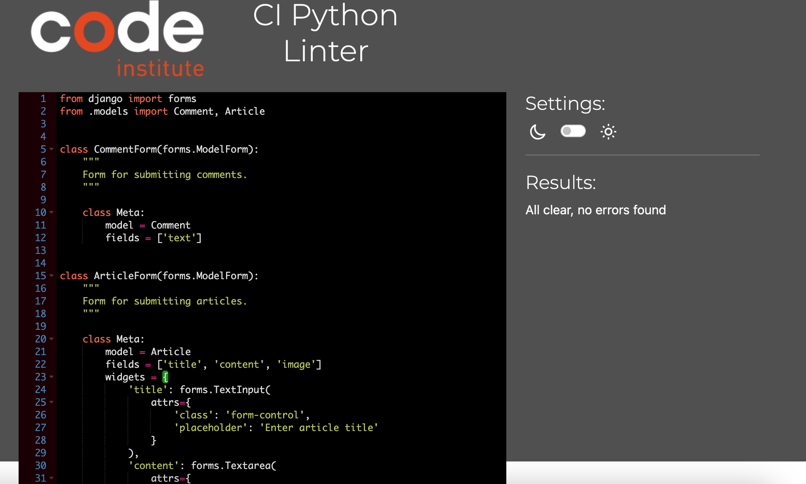
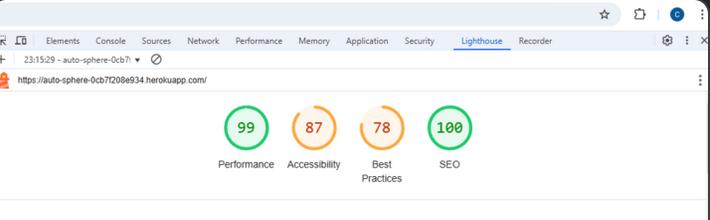

# The Autosphere Test Page

### Return to [README.md](README.md) file.

## Table Of Contents

- [Code Validation](#code-validation)
- [Browser Compatibility](#browser-compatibility)
- [Manual Testing](#manual-testing)
- [Responsiveness Testing](#responsiveness-testing)
- [Lighthouse Testing](#lighthouse-testing)

- [Known Bugs](#known-bugs)

# Code Validation

Below are the tools used for code validations.

* Validation Links

- [HTML Validation](https://validator.w3.org/)
- [CSS Validation](https://jigsaw.w3.org/css-validator/)
- [JavaScript Validation (JSHint)](https://jshint.com/)
- [Python Validation (PEP8)](https://pep8ci.herokuapp.com/)

 * All codes were validated using the validation tools respectively.

  * HTML Validtion: [HTML Validation](https://validator.w3.org/)

     * During the validation of HTML codes, errors regarding stray closing divs but was removed.
     * Warnings and errors due to the use of Django template snippets. 

     

 * CSS Validation: [CSS Validation](https://jigsaw.w3.org/css-validator/)

    * No errors found when validated.

     

 * Javascript Validation: [JavaScript Validation (JSHint)](https://jshint.com/)

     

 * Python Validation: [Python Validation (PEP8)](https://pep8ci.herokuapp.com/)

 
     

     

     

     

     

 
## Browser Compatibility
 
 * I tested the deployed site on the following  browsers to check for compatibility issues and the expected results were all good.

 - Firefox
 - Chrome
 - Safari

   
|              |Articles/Add Articles|
|   Home       | Signup/login/logout |   Results    |
|--------------|---------------------|------------  |
| Displays as  |Opens when clicked   |  Pass        |  
|  expected    |
|              |Navigate to comment  |  Pass        |   
|              |section              |
|              |Navigate to add      |  Pass        |
|              |articles
|              |                     |
|              |Navigate to delete   |  Pass        |
|              |section
|              |                     |
|              |Navigate to edit     |  Pass        |
|              |section              |              |

### Manual Test 

* I performed manual testing to ensure the site is functioning properly.

| Results|Homepage/Signup/Login/Logout
|--------|-------------------------------
|Good    |Clicking the URL displays  the home page,
|        |
|Good    |Clicking on the signup takes user to 
|        |the signup page
|Good    |Clicking on the login takes user to the login 
|        |page.
|Good    |Clicking on logout,the user can see 
|        |logout confirmation message.

|Results |Articles/Readmore/Comment/Up/Downvotes
|--------|----------------------------------------
|Good    |The user can view the articles
|        |
|Good    |When click on readmore it opens
|        |
|Good    |Login users can add comment 
|        |
|Good    |Login users can up/downvote

|Results |Add Article/Edit/Delete/confirmation
|--------|---------------------------------------
|Good    |Login users can add articles
|Good    |Login users can edit
|Good    |Login users can delete
|Good    |Login users recieves confirmation message

|Results |Admin
|--------|---------------------------------------
|Good    |Admin can view total articles on site
|Good    |Admin can see article detailes when clicked
|Good    |Admin can delete inappropriate article
|Good    |Admin can view number of up/downvotes

* Mobile Devices Testing
	
|           |iphone xr |iphone 16 | oppo A54 5G|
|---------- | ---------|----------|------------|
|Home  	   | Pass 	  |Pass 	    |Pass        |
|Signup     | Pass     |Pass      |Pass        |
|Login      | Pass     |Pass      |Pass        |
|Images 	   | Pass 	  |Pass 	    |Pass        |
|Links 	   | Pass 	  |Pass 	    |Pass        |
|Add Article| Pass     |Pass      |Pass        |
|Comment    | Pass     |Pass      |Pass        |
|Edit       | Pass     |Pass      |Pass        |
|Delete     | Pass     |Pass      |Pass        |

### Light house Testing

### Known/Resolved Bugs

* During the validation of HTML codes, errors regarding stray closing divs but was removed.
* Warnings and errors due to the use of Django template snippets. 